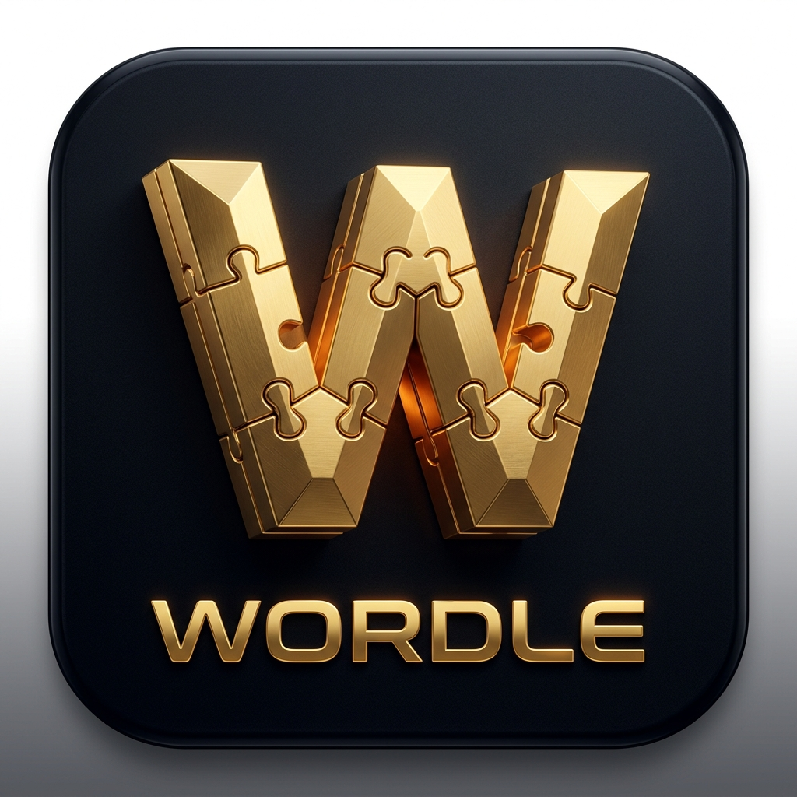

<p align="center">
  
</p>

# 🧩 Wordle: Premium Journey


A highly polished, cinematic progression-based mobile game built with Flutter. **Wordle: Premium Journey** transforms the classic word-guessing utility into a full-fledged, luxurious gaming experience complete with worlds, chapters, persistent progression, and high-end animations.

---

## ✨ Premium Features

*   🎬 **Cinematic Startup Experience:** A custom-engineered splash screen featuring a 60fps staggered logo reveal, ambient particle engine, and glowing segmented loaders. Bypasses standard OS clipping for a flawless entrance.
*   🌍 **World Progression System:** Players advance through dynamically unlocked Worlds and Chapters, turning standard gameplay into an addictive journey.
*   🏆 **Persistent Statistics & Profiles:** Integrated with Firebase Cloud Firestore to securely save and sync player statistics, win streaks, and unlocked achievements across devices.
*   💎 **Midnight & Gold UI Design:** A custom design system built around deep `#0D0D0E` black backgrounds, glassmorphic overlays, and premium gold accents.
*   🔐 **Secure Authentication:** Frictionless Google Sign-In and anonymous progression states powered by Firebase Authentication.
*   🚀 **Native OS Integration:** Hand-crafted, properly scaled Android and iOS adaptive launcher icons that perfectly match the in-game aesthetic.

---

## 🛠️ Tech Stack & Architecture

*   **Frontend:** Flutter (Dart)
*   **Backend:** Firebase (Auth, Firestore)
*   **Architecture Pattern:** Repository Pattern (Decoupled Services, Controllers, and Repositories)
*   **Key Packages:**
    *   `cloud_firestore` / `firebase_auth` for backend integration.
    *   `google_sign_in` for seamless onboarding.
    *   `shared_preferences` for local cache state.
    *   `flutter_launcher_icons` for native OS branding.

---

## 📂 Project Structure

The codebase is organized using a feature-first modular architecture to ensure scalability:

```text
lib/
 ├── core/         # Design system (app_theme.dart), constants, global utilities
 ├── data/         # Dictionary, raw word lists, and data models
 ├── models/       # Data classes (World, Achievement, Stats)
 ├── shared/       # Cross-feature widgets and Repositories (Data access layer)
 ├── services/     # Firebase, GraphQL, and Authentication logic
 ├── controllers/  # Business logic and state management
 ├── screens/      # Core app views (Splash, Home, Main)
 └── pages/        # Feature-specific views (Wordle gameplay, Worlds, Statistics)
```

---

## 🚀 Getting Started

To run this project locally, you will need the Flutter SDK and a configured Firebase project.

### Prerequisites
*   Flutter SDK (v3.2.3 or higher)
*   Android Studio / Xcode for deployment
*   A `google-services.json` file placed in `android/app/` (Note: This is ignored in git for security).

### Installation
1. Clone the repository:
   ```bash
   git clone https://github.com/yourusername/wordle.git
   ```
2. Install dependencies:
   ```bash
   flutter pub get
   ```
3. Run the application:
   ```bash
   flutter run
   ```

---
*Engineered with precision for a AAA mobile puzzle experience.*
